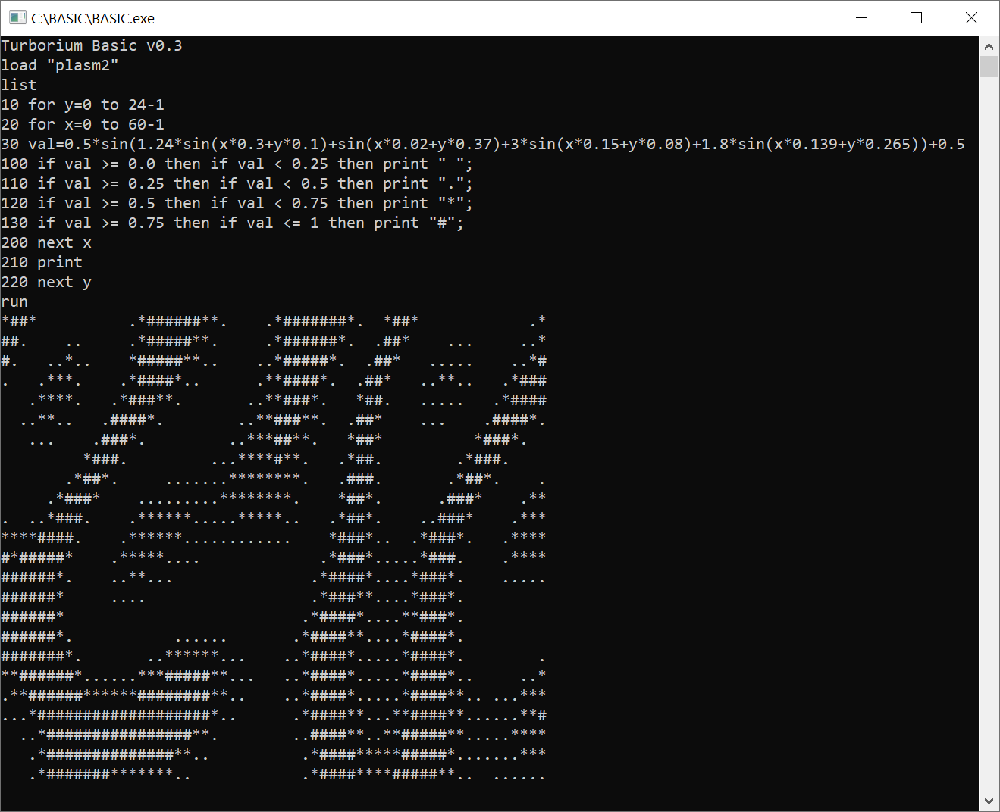

# TurboriumBasic
**Simple BASIC interpriter**

[Powered By Delphi (ObjectPascal)](https://www.embarcadero.com/)  



## Введение
Простейший интерпритатор языка BASIC.  
Данный поект являеться "чистым" интерпритатором бейсика с нумерованными строками, без какого-либо промежуточного представления.

Поскольку на стримах по его написанию не было особой активности интерпритатор был заброшен на какое-то время, однако, в конечном итоге в один из дней я решил довести проект до MVP. Именно в состоянии вполне рабочего прототипа я выложил этот проект на github.

## Как работать с бейсиком?
В классическом бейсике из 80-х каждая строка программы имеет логический номер, обычно программисты нумеровали строки в числе кратные 10, для удобства вставки строк.  

По умолчанию бейсик находиться в непосредственном режиме, что позволяет делать какие-то базовые вещи без написания программы, например посчитать выражение ```PRINT 10\*2```.       

Для добавления строки в программу надо перед кодом указать номер строки, например так: ```10 PRINT "HELLO WORLD"```.

Для запуска программы используеться комманда ```RUN```.

Если ваша программа "зациклилась", ее можно остановить комбинацией клавиш ```CTRL+B```.

Для изменеения строки программы достаточно ввсети ее снова под тем же номером.

Для удаления строки достаточно ввести номер удаляемой строки.  

Чтобы понять как с этим работать смотрите хайлайт стрима: https://www.youtube.com/watch?v=Vwb4RhI1Qrw
 
В папке "BASIC" лежит скомпилированная версия для Windows(лучшей ОС).   
Для любителей Linux можно, немного изменив код, получить версию для кросплатформенной IDE Lazarus/FreePascal. Да, придеться постараться, если вы любитель данной ОС. С другой стороны - если вы истинный любитель GNU и т.д. вы должны переписать это на C + GCC, дабы не ныть о begin/end в паскале.  

### Как запустить?
[Скачать](https://github.com/turborium/turboriumbasic/archive/refs/heads/main.zip) репозиторий, или архив из [Releases](https://github.com/turborium/turboriumbasic/releases), в папке BASIC - лежит уже собранная версия интерпритатора.  

Если есть желание "собрать", то надо скачать [Delphi Commynity](https://www.embarcadero.com/products/delphi/starter), открыть проект, нажать на "Run". Готово. 

### Как загрузить пример?
1) Запустить "BASIC.EXE"
2) Ввести ```LOAD "<имя файла>"```, например ```load "circle"```
3) По желанию вывести "текст программы" на экран командой ```LIST```
4) Запустить командой ```RUN```

## Примеры кода:

### Цикл FOR
```basic
10 PRINT "*** FOR TEST ***"
20 FOR i=1 TO 5 STEP 0.5
30 PRINT "i = ";i
40 NEXT i
```

### Эффект плазмы
```basic
10 for y=0 to 24-1
20 for x=0 to 60-1
30 val=0.5*sin(1.24*sin(x*0.3+y*0.1)+sin(x*0.02+y*0.37)+3*sin(x*0.15+y*0.08)+1.8*sin(x*0.139+y*0.265))+0.5
100 if val >= 0.0 then if val < 0.25 then print " ";
110 if val >= 0.25 then if val < 0.5 then print ".";
120 if val >= 0.5 then if val < 0.75 then print "*";
130 if val >= 0.75 then if val <= 1 then print "#";
200 next x
210 print
220 next y
```

## Поддержанные фичи:

### В непосредственном режиме

LOAD "\<name\>" - загружает программу по имени "\<name\>.bas"  

SAVE "\<name\>" - сохраняет программу с именем "\<name\>.bas"   

NEW - создать новую программу

LIST - вывести программу на экран. LIST n1-n2 - вывести программу со строчки по номеу n1 по строчку по номер n2  

RUN - запустить программу  

### Команды BASIC

PRINT - печатает на экране. "строка" - вывод строки, 123 - вывод числа. var1 - вывод значения переменной var1. Можно разделять ";" - нет перехода к следующему столбцу. "," - переход к следующему столбцу при выводе.

INPUT - вводит зачения. INPUT "вопрос"; a,b - ввод значений в переменные a и b, через запятую, с кастомным сообщением пользователю. Если не указать строку ссобщения будет выведено " ?"

Ля, лень дальше писать, смотрите примеры. Ну или для желающих - создайте пулл-реквест с дополнением документации в этом файле.


